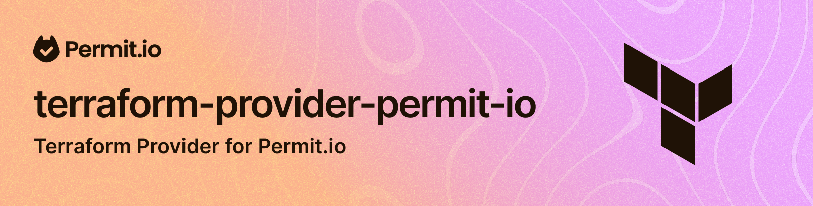

# Permit.io Terraform Provider

Permit.io is a cloud-based authorization service that allows you to define and manage permissions for your application.
In order to make it easier and safer to manage your objects and policies in Permit.io, we have created a Terraform provider.
 


_This provider repository is built on the [Terraform Plugin Framework](https://github.com/hashicorp/terraform-plugin-framework). The template repository built on the [Terraform Plugin SDK](https://github.com/hashicorp/terraform-plugin-sdk) can be found at [terraform-provider-scaffolding](https://github.com/hashicorp/terraform-provider-scaffolding). See [Which SDK Should I Use?](https://developer.hashicorp.com/terraform/plugin/framework-benefits) in the Terraform documentation for additional information._

## Usage 

The [examples directory](./examples) contains a number of examples of how to use the provider.

### Provider Definition

```hcl
terraform {
  required_providers {
    permitio = {
      source  = "registry.terraform.io/permitio/permit-io"
      version = "~> 0.0.1"
    }
  }
}
```


### Configure the Provider
```hcl
provider "permitio" {
    api_url = "https://api.permit.io" # Defaults to - "https://api.permit.io - Can be set as an environment variable PERMITIO_API_URL
    api_key = "YOUR_API_KEY" # Can be set as an environment variable PERMITIO_API_KEY
}
```

### Creating Objects in Permitio

#### Create a Resource
```hcl
resource "permitio_resource" "document" {
  key         = "document"
  name        = "Document"
  description = "A confidential document"
  actions     = {
    "read" : {
      "name" : "Read",
      "description" : "Read a document",
    },
    "write" : {
      "name" : "Write",
      "description" : "Write a document",
    }
  }
  attributes = {}
}
```

#### Create a Role

```hcl
resource "permitio_role" "reader" {
  key         = "reader"
  name        = "Reader"
  description = "A role that allows reading documents"
  permissions = [
    "document:read"
  ]
  extends     = []
  depends_on  = [
    permitio_resource.document # This is required to ensure that the resource is created before the role (for the permissions assignment)
  ]
}
```


## Requirements

- [Terraform](https://developer.hashicorp.com/terraform/downloads) >= 1.0
- [Go](https://golang.org/doc/install) >= 1.19

## Building The Provider

1. Clone the repository
1. Enter the repository directory
1. Build the provider using the Go `install` command:

```shell
go install
```

## Adding Dependencies

This provider uses [Go modules](https://github.com/golang/go/wiki/Modules).
Please see the Go documentation for the most up to date information about using Go modules.

To add a new dependency `github.com/author/dependency` to your Terraform provider:

```shell
go get github.com/author/dependency
go mod tidy
```

Then commit the changes to `go.mod` and `go.sum`.

## Using the provider

Fill this in for each provider

## Developing the Provider

If you wish to work on the provider, you'll first need [Go](http://www.golang.org) installed on your machine (see [Requirements](#requirements) above).

To compile the provider, run `go install`. This will build the provider and put the provider binary in the `$GOPATH/bin` directory.

To generate or update documentation, run `go generate`.

In order to run the full suite of Acceptance tests, run `make testacc`.

*Note:* Acceptance tests create real resources, and often cost money to run.

```shell
make testacc
```
