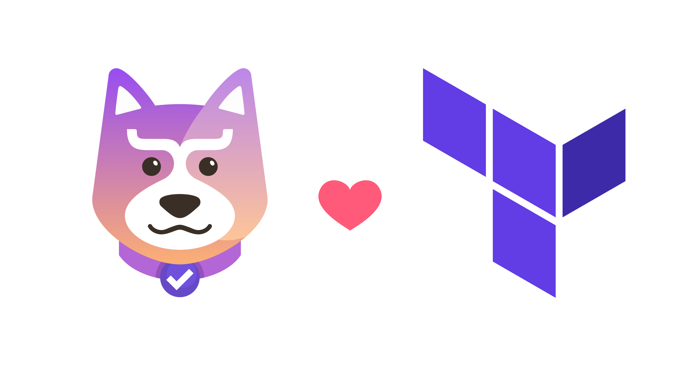

# Permit.io Terraform Provider



Permit.io is a cloud-based authorization service that allows you to define and manage permissions for your application.
In order to make it easier and safer to manage your objects and policies in Permit.io, we have created a Terraform provider.

## Documentation

- Use our public docs site for more info - https://docs.permit.io
- This Terraform provider has an auto-generated documentation site - https://registry.terraform.io/providers/permitio/permit-io/latest/docs


## Usage

The [examples directory](./examples) contains a number of examples of how to use the provider.
Each resource and data source has an example under `examples/resources/` or
`examples/data-sources/`, which its page in `docs/` shows. The tests validate every example
under `examples/` with the provider built from this repository; the snippets below are not
validated, so the examples are the reference.

### Provider Definition

```hcl
terraform {
  required_providers {
    permitio = {
      source  = "permitio/permit-io"
      version = "~> 1.0"
    }
  }
}
```

### Configure the Provider

```hcl
# Set the API key in api_key or in the PERMITIO_API_KEY environment variable.
# api_url (default https://api.permit.io) and timeout (seconds, default 10) can
# also be set with PERMITIO_API_URL and PERMITIO_TIMEOUT. A value set in this
# block takes precedence over its environment variable, so leave an argument out
# to use the environment variable.
provider "permitio" {}
```

### Creating Objects in Permitio

#### Create a Resource

```hcl
resource "permitio_resource" "document" {
  key         = "document"
  name        = "Document"
  description = "A confidential document"
  actions     = {
    "read" : {
      "name" : "Read",
      "description" : "Read a document",
    },
    "write" : {
      "name" : "Write",
      "description" : "Write a document",
    }
  }
  attributes = {}
}
```

#### Create a Role

```hcl
resource "permitio_role" "reader" {
  key         = "reader"
  name        = "Reader"
  description = "A role that allows reading documents"
  # Building the permission from the resource's key makes Terraform create the
  # resource before the role.
  permissions = [
    "${permitio_resource.document.key}:read"
  ]
  extends     = []
}
```

#### Create a User Attribute

```hcl
resource "permitio_user_attribute" "department" {
  key         = "department"
  description = "The department of the user"
  type        = "string"
}
```

#### Create a Tenant

```hcl
resource "permitio_tenant" "acme_corp" {
  key         = "acme-corp"
  name        = "Acme Corporation"
  description = "Main tenant for Acme Corporation"
  attributes  = jsonencode({
    region = "us-west"
    tier   = "enterprise"
  })
}
```

## Requirements

To use the provider, one of:

- [Terraform](https://developer.hashicorp.com/terraform/install) 1.5.7 or later. The offline
  tests, against a mock of the Permit API, run on 1.5.7 and 1.16.
- [OpenTofu](https://opentofu.org/docs/intro/install/) 1.11 or later. The offline tests run on
  1.11 and 1.12.

To build the provider from source: [Go](https://go.dev/doc/install) 1.26 or later.

Each release is published for 13 platforms: `darwin_amd64`, `darwin_arm64`,
`freebsd_386`, `freebsd_amd64`, `freebsd_arm`, `freebsd_arm64`, `linux_386`,
`linux_amd64`, `linux_arm`, `linux_arm64`, `windows_386`, `windows_amd64` and
`windows_arm64`. The offline tests run on `linux_amd64` with each of those Terraform and
OpenTofu versions, and on `darwin_arm64` and `windows_amd64` with Terraform 1.16; the
other platforms are cross-compiled and not tested. On macOS the provider needs
macOS 12 (Monterey) or later, because it is built with Go 1.26.

## Building The Provider

1. Clone the repository
1. Enter the repository directory
1. Build the provider using the Go `install` command:

```shell
go install
```

## Adding Dependencies

This provider uses [Go modules](https://github.com/golang/go/wiki/Modules).
Please see the Go documentation for the most up to date information about using Go modules.

To add a new dependency `github.com/author/dependency` to your Terraform provider:

```shell
go get github.com/author/dependency
go mod tidy
```

Then commit the changes to `go.mod` and `go.sum`.

## Developing the Provider

If you wish to work on the provider, you'll first need [Go](http://www.golang.org) installed on your machine (see [Requirements](#requirements) above).

To compile the provider, run `go install`. This will build the provider and put the provider binary in the `$GOPATH/bin` directory.

To generate or update documentation, run `go generate`.

In order to run the full suite of Acceptance tests, run `make testacc`.

_Note:_ Acceptance tests create real resources, and often cost money to run.

```shell
make testacc
```
